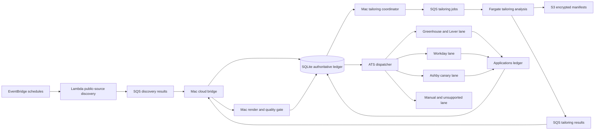

# Hybrid Jobhunt Pipeline and Ashby Recovery Design

**Date:** 2026-08-22
**Status:** Approved in chat for specification
**Owner:** David Cui
**System:** `/Users/davidcui824/jobhunt`

## 1. Summary

The jobhunt pipeline is not compute-bound. It is currently constrained by ATS-specific submission reliability and queue composition:

- At the design checkpoint, 111 `ready` rows were all Ashby.
- Only 2 rows remained `queued`.
- The prior generic stealth rollout produced 1 confirmed Ashby submission from 16 post-rollout attempts. Nine were explicit spam rejections, four needed user facts, one was unconfirmed, and one failed.
- On 2026-08-20, 19 applications were confirmed while 68 rows became manual and 12 failed.
- The current submitter is serial, counts only confirmed submissions toward its per-run cap, and can spend most of its 40-minute budget on slow failures.
- Unsupported and unknown ATS rows consume discovery and tailoring work but cannot complete automatically.

The selected architecture is hybrid:

1. The Mac remains the only final browser submission endpoint and the only writer to the authoritative SQLite database.
2. Submission work is partitioned by ATS, with independent concurrency, pacing, and circuit breakers.
3. Ashby uses a dedicated persistent installed-Chrome profile and an evidence-driven canary ramp instead of fabricated browser fingerprint values.
4. AWS handles cloud-safe discovery and tailoring analysis through EventBridge, Lambda, SQS, Fargate, Bedrock when available, and encrypted S3 artifacts.
5. Every stage emits structured outcome telemetry so throughput decisions use confirmed results rather than global timers.

## 2. Goals

### 2.1 Primary goals

- Drain supported non-Ashby work without being blocked by Ashby, SmartRecruiters, Workday, or unknown ATS failures.
- Recover Ashby submissions without repeatedly burning applications against an explicit spam rejection.
- Submit every eligible posting, including multiple distinct roles at the same company, while preventing duplicate submission of the same posting.
- Use AWS credits for discovery breadth, tailoring latency, durability, and observability.
- Preserve residential network identity and persistent browser state for final submissions.
- Keep all browser automation invisible on David's screen.
- Preserve truthful resumes and fail-closed question answering.
- Retain a local fallback when AWS is unavailable.

### 2.2 Success measures

- A blocked ATS lane does not stop another ATS lane.
- Supported non-Ashby rows begin an attempt within 15 minutes at p95 while the Mac is online.
- No posting is submitted more than once.
- Distinct posting IDs at the same company are no longer suppressed solely because one role was already submitted.
- Every submission attempt records ATS, duration, browser mode, result class, reason, and artifact references.
- Ashby never performs a second automatic attempt after an explicit spam rejection until its breaker permits a new canary.
- AWS delivery is idempotent under duplicate SQS messages and worker retries.
- Cloud payloads exclude contact details, Gmail tokens, answer-bank secrets, browser profiles, screenshots, and final resumes.
- The system remains functional in all-local mode.

## 3. Non-goals

- CAPTCHA solving or paid CAPTCHA services.
- Rotating residential proxies or changing identities to evade checkpoints.
- Cloud-hosted final application submission in the first release.
- Migrating the authoritative ledger from SQLite to PostgreSQL.
- Running the Mac and a cloud host against independent copies of SQLite.
- Replacing the current truthful-answer policy.
- Automatically retrying definitive or uncertain prior submissions.
- Adding adapters for every unsupported ATS in the same project.

## 4. Design principles

1. **Optimize confirmed submissions, not attempts.** A faster rejection loop is not useful throughput.
2. **Partition external failure domains.** One ATS breaker must not pause unrelated ATSs.
3. **Keep irreversible effects local and serialized by claim.** Cloud work may prepare artifacts but cannot click Submit.
4. **Use at-least-once queues with idempotent consumers.** Delivery duplication must be harmless.
5. **Keep the final ledger authoritative.** Only the Mac transitions a posting into `submitted` and inserts the application ledger row.
6. **Measure before increasing rate.** Ashby cadence changes only after confirmed canaries.
7. **Do not fabricate facts or identity.** Browser changes may preserve real state but may not alter application facts.
8. **Fail closed on ambiguity.** An attempted click without confirmation is quarantined, not retried.

## 5. Architecture

### 5.1 Trust boundary

AWS may receive public job data and a de-identified tailoring context. It must not receive:

- David's name, email, phone number, or address
- Gmail OAuth material
- application answer-bank secrets
- Workday credentials
- browser cookies or persistent profiles
- screenshots
- generated final resumes

The cloud tailorer returns a structured tailoring manifest. The Mac merges that manifest into the canonical resume, adds contact details locally, compiles the PDF, runs quality checks, and records the artifact path.

This boundary keeps final PII and submission credentials on the Mac while still offloading the expensive and parallelizable reasoning stage.

### 5.2 Authoritative state

`out/tracker.db` remains authoritative. SQLite must use WAL mode and a nonzero busy timeout. All state transitions continue to use compare-and-set status updates.

AWS queues are transport, not truth. A message is acknowledged only after the Mac records its result or safely recognizes an already-recorded idempotency key.

## 6. Local ATS dispatcher

### 6.1 Replace global FIFO behavior

The dispatcher classifies each `ready` posting into an ATS lane before launching an adapter. The first release uses these lane policies:

| Lane | Initial concurrency | Initial policy |
| --- | ---: | --- |
| Greenhouse, Lever, Workable, Rippling | 2 total | Normal pacing, independent from other breakers |
| Workday | 1 | Preserve tenant credentials and account recovery sequencing |
| Ashby | 1 canary slot | Token-bucket cadence and strict spam breaker |
| SmartRecruiters | 0 automatic submit | Prefill or manual handoff only because CAPTCHA solvers are excluded |
| iCIMS and unknown | 0 | Classify and retain for adapter backlog or manual handoff |

The dispatcher may later split the first lane by ATS if telemetry shows meaningful contention.

### 6.2 Attempt accounting

The current run limit counts only confirmed submissions. That allows a stream of failures to consume the full 40-minute budget. The new dispatcher enforces all of the following:

- maximum attempts per lane per run
- maximum wall-clock time per adapter process
- maximum concurrent browser processes
- maximum confirmed submissions per policy window
- ATS-specific token buckets

A failed, manual, stale, or unconfirmed attempt consumes an attempt slot even when it does not consume a confirmed-submission slot.

### 6.3 Duplicate prevention

The global one-application-per-company guard is removed. It conflicts with the requirement to apply to every eligible distinct role.

Duplicate prevention uses:

1. exact `posting_id`
2. canonical application URL and ATS job identifier
3. the append-only `applications` ledger
4. an active submission claim for the same canonical posting

Distinct job IDs at the same company may proceed. Mirror URLs for the same ATS job collapse to one canonical posting.

### 6.4 Unknown ATS handling

Unknown or unsupported rows are classified before tailoring. This avoids spending a model call and compiling a resume that cannot be submitted.

The classifier records host, form signature, detected vendor, and resolution reason. Unknown rows enter a visible adapter backlog ordered by eligible-role volume. They are not silently discarded.

## 7. Ashby recovery lane

### 7.1 Evidence

The existing generic stealth module changes user agent, plugins, languages, permissions, hardware values, and WebGL values. Those values can conflict with the real browser and hardware. It also creates a fresh browser and context for every posting.

After that rollout, the observed Ashby results were:

- 1 confirmed
- 9 explicit spam rejections
- 4 blocked on unanswered facts
- 1 unconfirmed
- 1 failed

The change therefore did not establish a trusted submission path.

### 7.2 Browser model

Ashby gets a dedicated persistent browser profile with these properties:

- installed stable Chrome or a dedicated Chrome for Testing build
- persistent user-data directory stored locally with restrictive permissions
- real browser-reported user agent, plugins, GPU, languages, timezone, and hardware values
- no fabricated plugin or WebGL objects
- headful rendering so the browser follows its normal rendering path
- process-scoped pre-launch hide watchdog so no window flashes on David's display
- no DeskPad and no display-awake dependency
- one browser session reused serially by the Ashby lane

If installed Chrome cannot be hidden without affecting David's normal browser windows, the release must use a separately identifiable Chrome for Testing application bundle. It must not hide the user's ordinary browser.

### 7.3 Canary protocol

The lane begins paused. Spam-rejected manual rows are never automatically retried.

The canary sequence uses previously unattempted, eligible Ashby postings:

1. Submit one canary after the clean cooldown window.
2. If confirmed, wait 180 minutes and submit the next canary.
3. After 3 consecutive confirmations and zero spam rejections, move to one attempt every 90 minutes.
4. After 10 consecutive confirmations and zero spam rejections, move to one attempt every 45 minutes.
5. Any explicit spam rejection trips a 24-hour breaker and returns the lane to the prior slower tier.
6. Any unconfirmed click quarantines that posting and pauses the lane for review without retrying it.

The cadence values are configuration with validated lower bounds. They may change only from observed success-rate evidence.

### 7.4 Diagnostic control

If the first persistent-browser canary is explicitly rejected, run one control through an ordinary trusted Chrome session on the same Mac and residential network. The control may prefill automatically, but the final submit action and result must be observed once.

Interpretation:

- Control succeeds: automation fingerprint or browser state remains the likely cause.
- Control is rejected: IP reputation, email-level reputation, or Ashby-side applicant scoring is more likely.
- Control is unconfirmed: confirmation detection must be fixed before another live attempt.

This single control prevents repeated speculative changes.

## 8. AWS offload

### 8.1 Discovery

EventBridge schedules Lambda pollers for public RSS, JSON, and documented ATS board APIs. Browser scraping remains off the cloud path.

Each normalized discovery message contains:

- schema version
- source name
- source posting identifier
- canonical URL
- company
- title
- locations
- first-seen timestamp
- raw source hash

The Mac cloud bridge consumes these messages, applies existing filters, deduplicates them, and writes SQLite.

### 8.2 Tailoring analysis

The Mac creates a `TailorJob` only after a posting passes filters and is supported or manually actionable. A job contains:

- schema version
- idempotency key
- posting ID
- company and title
- sanitized job description
- role track
- approved bullet-bank identifiers and text
- skills whitelist
- source and policy revisions

A Fargate worker calls the configured model, preferably through Bedrock when the account and credits support the required model. It emits a structured manifest containing selected bullets, permitted rewrites, skills, evidence links, and validation metadata.

The Mac validates the manifest, renders the final resume locally, runs deterministic quality checks, and moves the posting to `ready` only after success.

### 8.3 Queues and artifacts

Use separate SQS queues and dead-letter queues for:

- discovery results
- tailoring jobs
- tailoring results

Each message includes a schema version and idempotency key. Visibility timeouts exceed the maximum worker runtime. Consumers extend visibility while active and acknowledge only after durable completion.

S3 stores encrypted, short-lived tailoring manifests and worker diagnostics. Requirements:

- SSE-KMS
- block all public access
- least-privilege IAM
- versioning
- lifecycle deletion after 14 days for normal artifacts
- longer retention only for explicitly marked audit artifacts
- no final resumes, screenshots, browser profiles, or OAuth material

### 8.4 Local fallback

Cloud mode is optional. If SQS, Fargate, Bedrock, or S3 is unavailable, the coordinator may run the same tailoring interface locally. The manifest schema and deterministic quality gate are identical in both modes.

A cloud outage must delay preprocessing, not corrupt queue state or block already-ready local submissions.

### 8.5 Spend control

Infrastructure code may be planned and validated without creating resources. Creating billable AWS resources requires a separate explicit approval before `terraform apply`.

The deployment includes:

- account budget alert
- service cost tags
- Fargate task concurrency limit
- Lambda reserved concurrency
- SQS age alarms
- dead-letter queue alarms
- KMS and S3 access logging where appropriate

No NAT Gateway is required for the initial public-service design unless private networking is later justified by measured need.

## 9. Telemetry and control

### 9.1 Submission attempt ledger

Add an append-only `submission_attempts` table with:

- attempt ID
- posting ID
- ATS
- worker and lane
- browser mode and profile version
- start and finish timestamps
- outcome class
- normalized reason code
- raw reason excerpt
- click-attempted flag
- confirmation-observed flag
- artifact references
- policy revision

The existing `applications` table remains the confirmed-submission ledger.

### 9.2 Metrics

Track at least:

- ready queue depth and age by ATS
- attempts, confirmations, manual outcomes, failures, stale rows, and unconfirmed clicks by ATS
- p50 and p95 attempt duration by ATS
- confirmation rate by browser mode and policy revision
- breaker state and next eligible attempt time
- tailoring job latency, retries, and dead-letter count
- discovery source freshness and yield
- manual backlog by normalized reason

### 9.3 Adaptive control

Concurrency and cadence are configuration, not hard-coded duplicates. Any automatic rate increase must obey validated ceilings. Any material rise in spam, CAPTCHA, or unconfirmed outcomes reduces or pauses the affected lane without touching other lanes.

## 10. Error handling

- **Duplicate SQS delivery:** recognize the idempotency key and return the recorded result.
- **Worker crash before result:** SQS redelivers after visibility timeout.
- **Worker crash after S3 write:** result consumer validates manifest hash and records once.
- **Mac crash during browser submission:** stale `submitting` rows become manual because the external result is uncertain.
- **Definitive rejection:** record manual and do not retry automatically.
- **Unknown answer:** preserve fail-closed QA behavior and route to the daily Telegram digest.
- **AWS outage:** use local tailoring or leave rows queued.
- **SQLite contention:** WAL, busy timeout, short transactions, and compare-and-set transitions.
- **Browser profile corruption:** stop only the affected ATS lane, retain profile backup, and require a clean diagnostic before replacement.

## 11. Security and privacy

- Move long-lived API secrets out of launchd plist environment blocks and into macOS Keychain or a root-readable local secret file.
- AWS credentials use short-lived SSO sessions for humans and IAM roles for workloads.
- No AWS access keys are committed or embedded in launchd.
- S3 and SQS access is scoped to exact resource ARNs.
- Browser profiles and Workday credentials remain local and encrypted at rest where supported.
- Logs redact contact fields, answer-bank values, OAuth material, and credentials.
- Screenshots remain local and retain the existing deletion policy.

## 12. Rollout plan

### Phase 0: Baseline and containment

- Add attempt telemetry and reason normalization.
- Pause Ashby automatic retries while the new lane is prepared.
- Confirm the current database backup and restore procedure.
- Add regression tests for distinct-role submissions and exact-posting deduplication.

### Phase 1: Local dispatcher and Ashby recovery

- Introduce ATS lane selection and per-lane configuration.
- Count all attempts against run budgets.
- Keep current isolated adapter processes for non-Ashby lanes.
- Add the persistent hidden Chrome profile for Ashby.
- Execute the canary protocol and record outcomes.
- Keep all AWS flags disabled.

### Phase 2: Cloud-safe preprocessing

- Add versioned message schemas and the Mac cloud bridge.
- Add EventBridge and Lambda discovery pollers.
- Add SQS, dead-letter queues, Fargate tailoring workers, KMS, and S3.
- Validate with dry-run and synthetic duplicate delivery.
- Retain local tailoring fallback.
- Request separate approval before creating billable resources.

### Phase 3: Controlled throughput increase

- Raise non-Ashby local concurrency only after measured success.
- Ramp Ashby only through the canary tiers.
- Prioritize new adapters using unsupported eligible-role volume.
- Review whether Mac uptime justifies moving non-submit orchestration to EC2.

### Phase 4: Optional future distributed submission

Only consider PostgreSQL and multiple residential browser workers if one Mac becomes the measured final-submit bottleneck. AWS datacenter browser workers are not part of this phase unless real acceptance data shows they are viable.

## 13. Testing strategy

### 13.1 Unit tests

- ATS classification and lane routing
- token-bucket progression and rollback
- spam and unconfirmed circuit breakers
- attempt-budget accounting
- exact-posting deduplication with multiple roles at one company
- message schema validation
- idempotent discovery and tailoring result consumers
- secret and PII redaction
- cloud-disabled local fallback

### 13.2 Integration tests

- two local non-Ashby workers claiming distinct postings without duplication
- concurrent SQLite writes under WAL and busy timeout
- duplicate SQS deliveries producing one durable result
- worker termination before and after artifact write
- dead-letter routing after configured retry count
- cloud manifest to local PDF render and quality gate
- process-scoped browser hiding that leaves David's normal Chrome windows untouched

### 13.3 Acceptance checks

- All existing tests pass.
- Submit dry-run produces no external side effects.
- A blocked Ashby lane does not stop a ready Greenhouse or Lever row.
- Two distinct roles at one company can both reach `submitted` when each has a unique canonical job identifier.
- A repeated canonical posting cannot submit twice.
- A definitive spam rejection cannot be retried automatically.
- The first live Ashby canary produces one and only one external attempt.
- No visible automation window appears during an Ashby canary.
- Cloud payload inspection shows no prohibited PII or secrets.
- Disabling cloud flags returns the system to all-local operation.

## 14. Operational decisions

- The Mac is the authoritative control plane and submission endpoint.
- AWS is a preprocessing and durability plane.
- Ashby is a separate trust-sensitive lane.
- SmartRecruiters remains manual when CAPTCHA is present.
- Unsupported ATS volume drives adapter priority.
- Multiple distinct roles at one company are allowed.
- Terraform creation is not implied by code completion and requires explicit approval.

## 15. Deferred questions

These questions do not block the first implementation plan:

- Whether the account has Bedrock model access in the preferred region
- Whether AWS promotional credits cover Bedrock usage
- Whether Chrome for Testing or installed Chrome offers the cleanest process-scoped hiding behavior on this Mac
- Whether future adapter volume justifies iCIMS before other unknown vendors

Each is resolved by a bounded probe during its implementation task, not by broadening this architecture.
