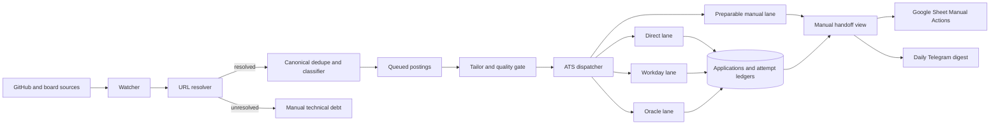

# Jobhunt Blocker Remediation Design

**Date:** 2026-08-24
**Status:** Approved in chat for specification
**Owner:** David Cui
**System:** `/Users/davidcui824/jobhunt`

## 1. Summary

The GitHub backfill and uncapped tailoring drain are working. The live queue reached zero, the resident dispatcher remained active, and the applications ledger reached 135 during the blocker audit. The remaining throughput debt is concentrated in a small number of failure domains:

- 611 manual rows have no adapter classification: 587 `other` and 24 `icims`.
- 303 of the `other` rows are Dreamwork wrapper pages rather than final application URLs.
- A live sample of 20 Dreamwork pages resolved to 7 Ashby, 4 Greenhouse, 2 Workday, 1 Lever, 1 SmartRecruiters, 2 Oracle Cloud, and 3 corporate application pages.
- 164 no-adapter rows are TikTok or ByteDance portals, 37 are Oracle Recruiting Cloud, and 24 are iCIMS.
- Workday has 105 ready rows, 46 failed rows, 46 manual rows, and 23 submitted rows. The two dominant failures are 24 missing Apply buttons and 22 missing resume upload zones.
- Workday account recovery succeeds in 42 of 50 recorded cases. The adapter fails to re-enter the application flow after some successful recoveries.
- 147 Ashby rows are blocked by the explicit spam policy, 18 SmartRecruiters rows are CAPTCHA-blocked, and roughly 20 Lever rows require a location choice behind hCaptcha.
- 44 click-uncertain rows are correctly quarantined, but the digest currently misclassifies them.
- Mac sleep is not a current blocker. System sleep is disabled, the seven-day power log has zero sleep entries, and redundant caffeinate assertions are active. Reboot without login caused one outage, but enabling automatic login is outside this design because of its security tradeoff.

The selected architecture is recovery-first:

1. Resolve wrapper URLs into real ATS URLs before classification.
2. Re-triage only rows parked for technical routing reasons.
3. Repair the existing Workday state machine before widening its lane.
4. Preserve CAPTCHA, spam, and click-uncertain safety boundaries while producing useful manual handoffs.
5. Add Oracle Recruiting Cloud as the next dedicated adapter.
6. Keep TikTok, iCIMS, and Ashby manual until stable authenticated fixtures or trusted paths exist.

## 2. Goals

### 2.1 Primary goals

- Recover the largest safely automatable portions of the 611-row no-adapter bucket.
- Preserve source provenance while routing wrapper listings to the final application URL.
- Prevent wrapper resolution or re-triage from causing duplicate applications.
- Repair Workday recovery re-entry and ambiguous Apply-button handling.
- Double Workday throughput without running two sessions against one tenant at the same time.
- Ensure every preparable manual row reaches a visible manual state instead of remaining hidden in `ready`.
- Give David one compact daily Telegram handoff with exact links and actions, not popup windows or notification piles.
- Correctly separate click-uncertain verification from forms that simply need a manual field or CAPTCHA.
- Add a conservative Oracle Recruiting Cloud lane after the existing recovery paths are stable.

### 2.2 Success measures

- Zero Dreamwork wrapper rows remain manual solely because `detect_ats` sees `other` when an original posting URL was resolved successfully.
- A resolved URL never creates an active canonical duplicate or an alias of an already-applied posting.
- Resolver failures remain manual with an explicit reason and preserved source URL.
- Workday re-enters Apply, Autofill with Resume, and upload discovery after successful account recovery.
- A missing Workday Apply button is terminal only when a closed or not-found marker is observed. Ambiguous failures remain retryable within the existing bounded retry policy.
- A Workday dispatch cycle never selects two postings from the same tenant.
- Workday runs with concurrency 2 and at most 4 attempts per cycle after the tenant exclusion test passes.
- Zero SmartRecruiters or other preparable-manual rows remain invisibly parked in `ready`.
- Click-uncertain rows appear only in the digest verification section and are never presented as unanswered-question work.
- Lever `/thanks` redirects count as confirmation.
- CAPTCHA detection before Submit produces a definitive manual handoff with `submission_uncertain=false` and no click.
- The daily Telegram copy contains compact manual action counts and a link to the complete spreadsheet view.
- Oracle Cloud starts at concurrency 1, records every attempt, and never retries a click-uncertain posting.

## 3. Non-goals

- CAPTCHA solving, paid CAPTCHA services, or CAPTCHA bypasses.
- Rotating proxies, browser identity spoofing, or evading ATS controls.
- Automatic retry of any click-uncertain submission.
- Re-enabling the Ashby automatic lane after explicit spam rejection.
- Building TikTok or ByteDance login automation in this project.
- Building iCIMS account automation without stable tenant fixtures.
- Enabling macOS automatic login or weakening FileVault protections.
- Adding another caffeinate layer.
- Moving final browser submissions to AWS.
- Replacing the authoritative SQLite ledger.

## 4. Design principles

1. **Recover routing before adding browsers.** A wrapper that already points to Greenhouse or Workday should use the trusted adapter instead of receiving a new adapter.
2. **Persist provenance.** The source listing URL remains recoverable after the active posting URL changes.
3. **Fail closed on ambiguous external state.** A missing button without closure evidence is retryable, not silently declared closed or submitted.
4. **Never retry uncertainty.** Any click without confirmation remains manual verification work.
5. **Partition tenant state.** Workday concurrency may increase only when one tenant has at most one live browser session.
6. **Prepare manual work without pretending it is automatic.** A tailored resume and filled screenshot are useful even when a CAPTCHA requires David.
7. **Use one daily handoff.** Telegram remains the primary action channel, with the spreadsheet holding the full list.
8. **Measure outcomes.** Lane changes are accepted from live confirmation, not process activity alone.

## 5. Architecture

### 5.1 State authority

`out/tracker.db` remains authoritative. All re-triage, lane claims, and submission transitions use compare-and-set updates. Browser workers use separate SQLite connections with WAL mode and a busy timeout.

The `applications` ledger remains the final duplicate guard. The `submission_attempts` ledger remains the source of truth for click state, confirmation, reason, and artifacts.

## 6. URL resolution and re-triage

### 6.1 Resolution boundary

Wrapper resolution occurs after source ingestion and before filtering or lane quarantine. It never occurs inside `classify_url`, `canonical_posting_key`, or a transaction that holds a submission claim.

The first resolver supports Dreamwork job pages. It extracts the `View original posting` target from a stable page selector. Network failures, missing selectors, unsupported schemes, redirect loops, and non-public targets fail closed.

Only `http` and `https` targets are accepted. Localhost, private network addresses, file URLs, JavaScript URLs, and credentials in URLs are rejected.

### 6.2 Provenance data

Add an idempotent `posting_url_resolutions` table:

| Column | Meaning |
| --- | --- |
| `posting_id` | Primary key and posting owner |
| `source_url` | Wrapper URL received from the source |
| `resolved_url` | Validated final application URL, nullable on failure |
| `resolver` | Resolver name and version |
| `resolved_at` | Unix timestamp of the latest successful resolution |
| `last_error` | Sanitized failure reason |
| `source_hash` | Hash of the source page or fixture used for the decision |

On success, the current `postings.url` becomes the resolved application URL. The wrapper remains in `posting_url_resolutions.source_url`. Future ingestion re-applies the cached mapping before filter and classification, so a source refresh cannot replace the resolved URL with the wrapper.

### 6.3 Canonical safety

Before changing `postings.url`, the resolver computes the canonical identity of the resolved target and checks:

1. the append-only applications ledger
2. active rows for the same canonical posting
3. terminal stale, closed, skipped, or submitted aliases
4. an active submission claim

A collision never revives or duplicates the posting. The source row is parked with the canonical conflict reason.

### 6.4 Re-triage

A re-triage command supports preview and apply modes. It considers only rows whose current manual reason is technical routing debt, such as `no adapter for other` or `no adapter for icims`.

It must not requeue:

- click-uncertain rows
- CAPTCHA or spam rows
- user-skipped rows
- stale or closed rows
- rows with any completed submission attempt
- rows whose canonical identity already exists in the applications ledger

Resolved rows entering automatic lanes move from `manual` to `queued` by compare-and-set. Preparable manual lanes remain `manual` and receive a prepared-handoff reason.

## 7. Lane model

Extend `LanePolicy` with an explicit preparation policy rather than inferring it from the lane name:

| Lane | Automatic submit | Prepare resume | Initial concurrency | Attempts per cycle |
| --- | --- | --- | ---: | ---: |
| Direct | yes | yes | 2 | 8 |
| Workday | yes | yes | 2 after tenant guard | 4 |
| Oracle | yes | yes | 1 | 2 |
| Ashby | no while disabled | yes | 1 canary only | 1 |
| Preparable manual | no | yes | 0 | 0 |
| Email and WaaS | separate owned flow | as required | 0 | 0 |
| Unsupported | no | no | 0 | 0 |

A preparable-manual row may be tailored and quality-checked, but its final preparation transition is `tailoring -> manual`, not `tailoring -> ready`. This prevents SmartRecruiters rows from becoming invisible to both the dispatcher and digest.

An idempotent reconciliation pass moves existing `ready` rows from nonautomatic lanes into `manual` with a precise handoff reason.

## 8. Workday repair

### 8.1 Idempotent form entry

Extract an `enter_application_form` helper that performs this sequence from fresh page state:

1. navigate to the canonical posting or application URL
2. detect explicit closed or not-found markers
3. locate and click the Workday Apply button
4. locate and click Autofill with Resume
5. verify that the upload control is visible

The helper reacquires every locator after navigation. It does not reuse a locator created before account recovery.

The adapter calls this helper initially and again after successful account access or password recovery. This removes the post-recovery re-entry gap that currently produces blank-page upload failures.

### 8.2 Missing Apply button classification

When Apply is missing:

- explicit closed, no-longer-accepting, or job-not-found evidence produces a terminal stale result with the observed marker
- an authentication gate invokes the existing recovery path
- all other cases try the canonical `/apply` form once when the tenant supports it
- continued ambiguity produces a retryable failure, not a terminal closure claim

The retry remains bounded by the existing attempt policy. No new retry is allowed after a submit click.

### 8.3 Tenant-safe concurrency

Add a stable Workday tenant key derived from the Workday host and tenant path. `select_for_lane` excludes candidates whose tenant is already selected or executing in the same cycle.

After the guard is validated, change Workday from concurrency 1 with 2 attempts per cycle to concurrency 2 with 4 attempts per cycle. Each worker still gets its own browser context and SQLite connection.

## 9. External blocker handoff

### 9.1 Safety classification

These remain manual:

- Lever location hCaptcha
- SmartRecruiters DataDome
- Ashby explicit spam rejection or disabled-lane rows
- any click-uncertain attempt

No solver or automatic retry is introduced.

### 9.2 Correctness fixes

- Add word-bounded Lever `/thanks` support to confirmation URL detection.
- Detect hCaptcha or DataDome before the submit click where observable.
- A pre-submit CAPTCHA result is definitive manual with `click_attempted=false` and `submission_uncertain=false`.
- Fix digest collection so click-uncertain rows appear under verification, not unanswered questions.
- Reconcile existing SmartRecruiters `ready` rows into manual handoff state.

### 9.3 Artifact propagation

Adapters return sanitized `artifact_refs`, including a filled-form screenshot path when one exists. The executor passes those references into `finish_attempt`. Missing fields remain structured as `unanswered` rather than being embedded only in a reason string.

Artifact references never include cookies, headers, credentials, or form answers. Paths remain on the Mac and never enter Telegram or Google Sheets. The handoff records only whether a prepared resume or screenshot exists, while local operator tooling can open the real artifact.

### 9.4 Daily Telegram and spreadsheet handoff

The existing daily digest remains the only routine notification. It gains three distinct sections:

1. **Verify before retrying:** click-uncertain submissions, with no retry action.
2. **Finish manually:** exact application link and the one required action, such as location selection, CAPTCHA, or trusted-browser submit.
3. **Engineering debt:** grouped counts for unsupported vendors and adapter failures. These are for the agent, not requests to David.

The Google Sheet gains a `Manual Actions` tab containing every current manual action with company, role, ATS, action, URL, age, attempt state, and latest reason. Telegram includes a compact count, deadline-sensitive actions, and the Sheet link. It does not send one message per posting.

No browser tab opens automatically. David opens an exact link from Telegram or the Sheet in normal Chrome.

## 10. Oracle Recruiting Cloud adapter

### 10.1 Scope

Oracle Recruiting Cloud is the next adapter because 37 current rows share a platform family and do not require TikTok or iCIMS account semantics.

Detection recognizes verified Oracle Recruiting hosts and stable Oracle application signatures. It does not classify arbitrary `oracle.com` pages as application forms.

### 10.2 Lane and lifecycle

Oracle uses its own lane at concurrency 1 and 2 attempts per cycle. The adapter follows the shared lifecycle:

1. liveness and closure check
2. resume upload
3. core profile fields
4. shared grounded Q&A
5. required-field verification
6. pre-submit CAPTCHA check
7. point-of-no-return marker immediately before click
8. confirmation detection
9. fail-closed uncertainty quarantine

The first release supports only the observed common flow. Tenant variants that do not match a tested fixture remain manual with a precise unsupported-variant reason.

## 11. Error handling and observability

Every resolver and adapter outcome uses a structured class:

- `resolved`
- `unsupported_variant`
- `retryable_failure`
- `manual_captcha`
- `manual_spam`
- `manual_needs_input`
- `stale`
- `submission_uncertain`
- `submitted_confirmed`

Reasons are sanitized and bounded. The attempt ledger records duration, ATS, lane, confirmation, click state, missing fields, and artifact references.

Metrics and the digest report:

- wrapper resolution success by target ATS
- re-triaged rows by lane
- Workday recovery and re-entry outcomes
- Workday attempts and confirmations by tenant
- manual action counts by type
- Oracle outcomes and confirmation rate
- count of nonautomatic rows incorrectly left in `ready`, which must remain zero

## 12. Testing strategy

### 12.1 URL resolution

- Saved Dreamwork HTML fixture resolves the exact original posting URL with no network.
- Unsafe or missing targets fail closed.
- Cached resolutions survive source refresh.
- Resolved Greenhouse or Workday rows re-triage to `queued`.
- Resolved SmartRecruiters rows remain manual but preparable.
- TikTok and unresolved corporate pages remain manual.
- Wrapper and resolved forms cannot create duplicate active or applied identities.

### 12.2 Workday

- Successful recovery is followed by fresh navigation and a second Apply and Autofill sequence.
- Closed markers produce stale terminal outcomes.
- Missing Apply without a closed marker produces a retryable failure.
- A direct application fallback is tried only once.
- One dispatch cycle never selects two rows from the same tenant.
- Workday never exceeds two simultaneous workers.
- Existing date, answer, recovery, and uncertainty tests remain green.

### 12.3 Manual handoff

- SmartRecruiters and other preparable-manual rows cannot remain `ready`.
- Lever `/thanks` is confirmed.
- Pre-submit CAPTCHA detection does not click Submit.
- Click-uncertain rows render only in the verify section.
- Manual location rows include the exact field, URL, prepared-resume indicator, and a local attempt artifact when one exists.
- Telegram stays under its message limit and sends one daily copy.
- The Sheet contains every current manual action and no submitted row.

### 12.4 Oracle

- Saved fixtures cover liveness, upload, text, select, radio, checkbox, required validation, CAPTCHA, and confirmation.
- Unsupported tenant variants fail manual before click.
- Duplicate and click-uncertain protections use the shared executor tests.
- A dry run reaches the submit boundary with no click before any live canary.

## 13. Rollout

### Phase 1: correctness and visibility

1. Fix digest verification classification.
2. Add Lever `/thanks` confirmation.
3. Add pre-submit CAPTCHA probes.
4. Reconcile preparable-manual `ready` rows.
5. Add artifact propagation, safe artifact-availability fields, and the Sheet `Manual Actions` tab.
6. Verify the Telegram digest against the live read-only dataset without sending.

### Phase 2: Dreamwork recovery

1. Add the resolution schema and fixture-tested resolver.
2. Run preview mode against all Dreamwork manual rows.
3. Back up `tracker.db` and run `PRAGMA integrity_check`.
4. Apply re-triage with canonical collision checks.
5. Confirm zero duplicate, applied-alias, or offseason leaks.
6. Observe the resident pipeline drain newly queued supported rows.

### Phase 3: Workday repair and widening

1. Land re-entry and missing-button classification fixes.
2. Dry-run known failed tenants through the submit boundary.
3. Requeue only rows whose failure reason is covered by the fix and whose canonical posting remains live.
4. Add tenant exclusion and run with concurrency 1 for one observed cycle.
5. Raise to concurrency 2 and 4 attempts per cycle.
6. Verify no tenant overlap and compare confirmed outcomes.

### Phase 4: Oracle adapter

1. Add fixture-complete adapter and isolated lane.
2. Run dry-run canaries on representative tenants.
3. Back up and integrity-check the live database.
4. Run one production canary under the existing jobhunt authorization.
5. Inspect confirmation and attempt telemetry before enabling the remaining Oracle rows.

## 14. Requirement traceability

| Requirement | Check | Acceptance evidence |
| --- | --- | --- |
| Recover Dreamwork wrappers | Fixture resolver plus live preview | Resolved lane counts and zero unsafe targets |
| No duplicate applications | Canonical collision tests plus live ledger scan | Zero active duplicates and applied aliases |
| Repair Workday recovery | Post-recovery re-entry test and dry run | Upload control reached after successful recovery |
| Improve Workday throughput safely | Tenant exclusion test and live lane metrics | Two workers, zero same-tenant overlap |
| Keep CAPTCHAs manual | Pre-submit probe tests | No click and definitive manual outcome |
| Never retry uncertainty | Shared executor regression suite | Uncertain rows remain manual and unclaimed |
| Fix hidden manual work | Ready-lane reconciliation test | Zero nonautomatic rows in `ready` |
| Produce one useful handoff | Digest and Sheet integration tests | One Telegram copy and complete Manual Actions tab |
| Add Oracle conservatively | Fixture suite, dry run, one canary | Confirmed or safely classified single attempt |
| Preserve availability posture | Read-only power audit | No added caffeinate or auto-login change |

## 15. Explicit exclusions requiring a later decision

- Automatic login after reboot is not enabled. It would reduce reboot downtime but weakens physical security and may conflict with FileVault.
- Ashby remains disabled after empirical spam rejection.
- TikTok and ByteDance remain manual because their login portal is not a stable anonymous application flow.
- iCIMS remains manual until representative tenants and account behaviors are captured as fixtures.
- Cloud submission remains excluded because ATS browser sessions and residential network identity stay local.
